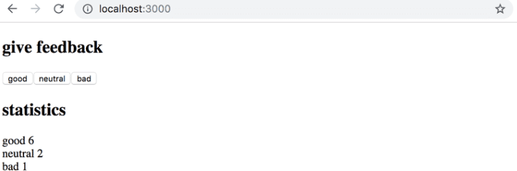
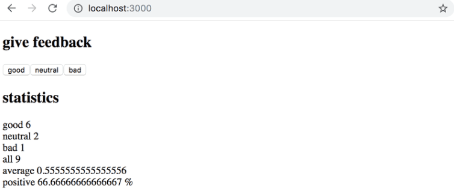
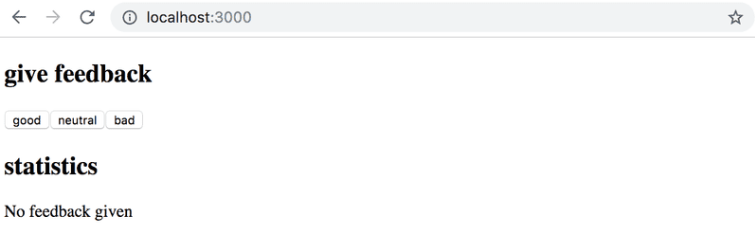

# Exercises 1.6.-1.14

## 1.6: unicafe step 1

Like most companies, the student restaurant of the University of Helsinki [Unicafe](https://unicafe.fi/) collects feedback from its customers. Your task is to implement a web application for collecting customer feedback. There are only three options for feedback: _good_, _neutral_, and _bad_.

The application must display the total number of collected feedback for each category. Your final application could look like this:



Note that your application needs to work only during a single browser session. Once you refresh the page, the collected feedback is allowed to disappear.

It is advisable to use the same structure that is used in the material and previous exercise. File _main.jsx_ is as follows:

```jsx
import React from 'react';
import ReactDOM from 'react-dom/client';

import App from './App';

ReactDOM.createRoot(document.getElementById('root')).render(<App />);
```

You can use the code below as a starting point for the _App.jsx_ file:

```jsx
import { useState } from 'react';

const App = () => {
  // save clicks of each button to its own state
  const [good, setGood] = useState(0);
  const [neutral, setNeutral] = useState(0);
  const [bad, setBad] = useState(0);

  return <div>code here</div>;
};

export default App;
```

## 1.7: unicafe step 2

Expand your application so that it shows more statistics about the gathered feedback: the total number of collected feedback, the average score (good: 1, neutral: 0, bad: -1) and the percentage of positive feedback.



## 1.8: unicafe step 3

Refactor your application so that displaying the statistics is extracted into its own _Statistics_ component. The state of the application should remain in the App root component.

Remember that components should not be defined inside other components:

```jsx
// a proper place to define a component
const Statistics = (props) => {
  // ...
}

const App = () => {
  const [good, setGood] = useState(0)
  const [neutral, setNeutral] = useState(0)
  const [bad, setBad] = useState(0)

  // do not define a component within another component
  const Statistics = (props) => {
    // ...
  }

  return (
    // ...
  )
}
```

## 1.9: unicafe step 4

Change your application to display statistics only once feedback has been gathered.



## 1.10: unicafe step 5

Let's continue refactoring the application. Extract the following two components:

- _Button_ handles the functionality of each feedback submission button.
- _StatisticLine_ for displaying a single statistic, e.g. the average score.

To be clear: the _StatisticLine_ component always displays a single statistic, meaning that the application uses multiple components for rendering all of the statistics:

```jsx
const Statistics = (props) => {
  /// ...
  return(
    <div>
      <StatisticLine text="good" value ={...} />
      <StatisticLine text="neutral" value ={...} />
      <StatisticLine text="bad" value ={...} />
      // ...
    </div>
  )
}
```

The application's state should still be kept in the root _App_ component.
